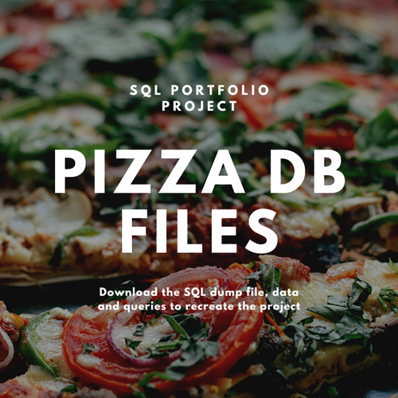

## Project Brief: 
### Designing a Relational Database for a Pizzeria

---
---

### Overview:
---
The project involves designing and building a tailor-made bespoke relational database for a new Pizzeria that will allow capturing and storing all important information and data generated by the business. The database will help monitor business performance in dashboards that will be built later. The three main areas of concentration include customer orders, stock levels, and staff.

### Objectives:
---
<ul>
    <li> Design and build a relational database for customer orders that will capture and store all important information and data generated by the business.</li>
    <li> Normalize the data, add more related tables, and define table relationships.</li>
    <li> Design and build dashboards to monitor business performance.</li>
    <li> Design and build databases for stock control data and staff data.</li>
</ul>

### Scope:
---
The project will cover the following areas:
<ul>
    <li>__Customer orders:__ The database will capture and store item name, item price, quantity, customer name, delivery address, order ID field, delivery address split out into different parts, different sizes of pizzas and beverages as a separate field, and product category.</li>
    <li> __Stock control data:__ The database will capture and store information on what ingredients go into each pizza, their quantity based on the size of the pizza, and the existing stock level.</li>
    <li> __Staff data:__ The database will capture and store information on which staff members are working when and how much each pizza is actually costing in terms of ingredients, chefs making the pizza, and the cost of delivery based on the time it took to deliver.</li>
    </ul>
   
   
   
### Approach:
---
The approach to designing the database involves specifying all fields for the data that need to be collected, normalizing the data, adding more related tables, and defining table relationships. Quick Database Diagrams (Quick DBD) is used as a tool to make the job of designing and building the database easier.

### Deliverables:
---
1. A tailor-made bespoke relational database for customer orders that captures and stores all important information and data generated by the business.

2. Dashboards to monitor business performance.
> __Dashboard 1 - Order Activity__
  
    For this, we will need a dashboard with the following data:
    <ul>
    <li>Total Orders</li>
    <li>Total Sales</li>
    <li>Total Items</li>
    <li>Average Order Value</li>
    <li>Sales By Category</li>
    <li>Top Selling Items</li>
    <li>Orders By Hour</li>
    <li>Sales By Hour</li>
    <li>Orders By Address</li>
    <li>Orders By Delivery/Pick Up</li>
    </ul>
    
> __Dashboard 2 - Inventory management__
 
    We need to see how much invemtory we're using and then identify inventory that needs reordering. We also want to see how much each pizza costs to make based on the cost of the ingridients so we can keep an eye on pricing and P/L. Here is what we need:
    <ul>
    <li>Total Quantity by Ingredients</li>
    <li>Total Cost of Ingredients</li>
    <li>calculated Cost of Pizza</li>
    <li>Percentage Stock remaining by Ingredient</li>
    <li>List of Ingredients To Re-order based on Remaining Inventory</li>
    </ul>
    
> __Dashboard 3 - Staff__
 
    We want to be able to monitor who was working on any given day or shift and what our overall staff costa are. Here is what we need:
    <ul>
    <li>Total Staff Costs</li>
    <li>Total Hours Worked</li>
    <li>Hours Worked by Staff Memeber</li>
    <li>Cost per Staff Member</li>
    </ul>

3. Databases for stock control data and staff data.

### Timeline:
---
The project is expected to be completed within 2 months.

### Budget:
---
The budget for the project is $50,000.

### Assumptions:
---
<ul>
    <li> The front-end ordering system will be built by someone else.</li>
    <li> The project will be completed within the specified timeline and budget.</li>
    <li> No external tools or services will be used to design or build the database.</li>
</ul>

### Data Dashboard
<iframe width="600" height="450" src="https://lookerstudio.google.com/embed/reporting/d027f0ed-fd15-4e17-a219-174a3f72c9ea/page/KYHdD" frameborder="0" style="border:0" allowfullscreen></iframe>

### Main Arears of Focus
    <ul>
        <li>Orders</li>
        <li>Stock control</li>
        <li>Staffs</li>
    </ul>

### Order data Required
    <ul>
        <li>Item name</li>
        <li>Item price</li>
        <li>Quantity</li>
        <li>Customer name</li>
        <li>Delivery Address</li>
    </ul>

I used Quick DBD to create the diagram of the database and the tables.

I also normalized the table to achieve the following:
    <ul>
        <li>reduce redundancy</li>
        <li>improve efficiency</li>
    </ul>

### Stock Control Requirements
The following are the requirements to be achieved with for stock control

    1. I wants to be abale to know when it's time ti order new stock
    2. To do this, we're going to need more information about:
        <ul>
            <li>what ingridient go into each pizza</li>
            <li>their quantity based on the size of the pizza</li>
            <li>the existing stock level</li>
        </ul>
    3. We'll assume the lead time for delivery by suppliers is the same for all ingridients.
    

### Statf Data Requirements
    1. Wants to know which staff members are working when
    2. based on the staff salary information, how much each pizza costs (ingridients + chefs + delivery)
    
    
I also used the Navicat MySQL instance because of it's simplicity in creating my database and inporting csv files to populate my tables, in just a few clicks.  

    
### Dashboards To Be Built
---

#### Dashboard 1
For this, I'll need a dashboard with the following data:
    1. Total orders
    2. Total sales
    3. Total items
    4. Average order value
    5. Sales by category
    6. Top selling items
    7. Ordes by hour
    8. Sles by hour
    9. Orders by address
    10. Orders by delivery/pick up
    
#### Dashboard 2 - Inventory Management
This will ba a lot more complicated that the orders. mainly because we need to calculate how mcu inventory we;re using and then identify inventory that needs reordering. We also want to calculate how much each pizza costs to make based on the cost of the ingridients so we can keep and eye on pricing and P/L.
Here's what we need:
    1. Total quantity by ingridient.
    2. Total cost of ingridients
    3. calculated cost of pizza
    4. percentage stock remaining by ingridient
    

### Creating The Report
I used Google Data Studio (Looker Studio) for creating the Dashboard and Report. I changes the columns data type so that I conforms to the neccessary norms like GEO Address for Addresses and Date & Time for date and time columns etc.

The dashboard focuses on the ten items requested in the brief above. The dashboard was built in two phases:
<ul>
    <li>Phase 1: Queries</li>
    <li>Phase 2: Design</li>
</ul>

### The steps I take
---
1. Build a SQL database
2. Write custom SQL queries
3. Build interactive dashboards

